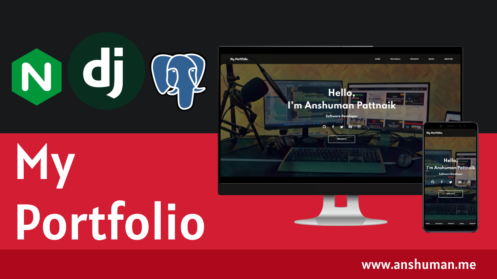

## Overview

A portfolio site is essential for every software developer to showcase projects, skills, etc. And I have built mine to showcase my open source project works.



## Technical Overview

The website is built using Django and to manage the data the database implementation is handled using PostgreSQL. 
And to serve the application in production it uses Gunicorn Web Server Gateway Interface to run the web application 
and NGINX as a reverse proxy to accept the incoming connection from gunicorn.sock file and route the traffic to the 
destination port.

### Portfolio URL

<a href="https://anshuman.me" target="_blank">https://anshuman.me </a>

### PostgreSQL Database Setup

To set up the initial database either you can use pgAdmin or postgres command line interface to create
the database & superuser.

````````````````````````````````````
sudo -u postgres psql postgres

CREATE DATABASE my_portfolio;
ALTER DATABASE my_portfolio OWNER TO guest;
CREATE ROLE guest WITH LOGIN SUPERUSER PASSWORD 'guest';
GRANT ALL ON SCHEMA my_portfolio TO guest;
````````````````````````````````````

### Installation

``````````````````````````````````````
git clone https://github.com/anshumanpattnaik/my-portfolio.git

cd my-portfolio
python3 -m venv venv
source ./venv/bin/activate (Linux) or ./venv/Scripts/activate (Windows)
pip3 install --upgrade pip
pip3 install wheel
pip3 install -r requirements.txt
``````````````````````````````````````

### Env Setup

Before running migrations first set up the env file in `settings.py`. 

Replace the below line at `Line no 8`.

`load_dotenv(os.path.join(BASE_DIR, 'dev_env/.env'))`

### Migrations

``````````````````````````````````````````````````
python3 manage.py migrate
python3 manage.py makemigrations app
python3 manage.py migrate app
``````````````````````````````````````````````````

### Dummy Data

To install the dummy records of the below tables execute the following command.

````````````````````````````````````
python3 admin.py
````````````````````````````````````

- Profile
- Project
- TechPlatform
- TechStack
- Blog

### Start the server

````````````````````````
python3 manage.py runserver 8000

Open http://127.0.0.1:8000 on your browser
````````````````````````

### License

This project is licensed under the [MIT License](LICENSE)
